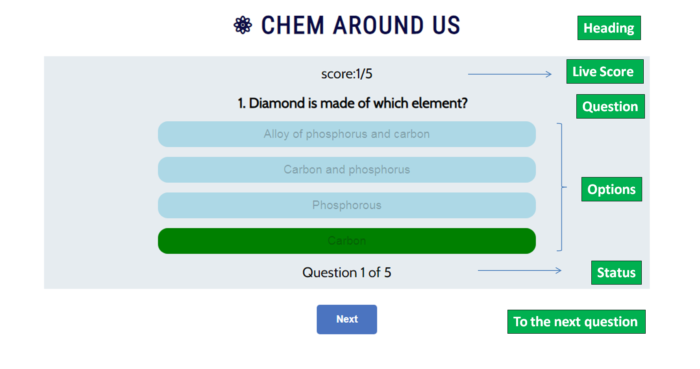
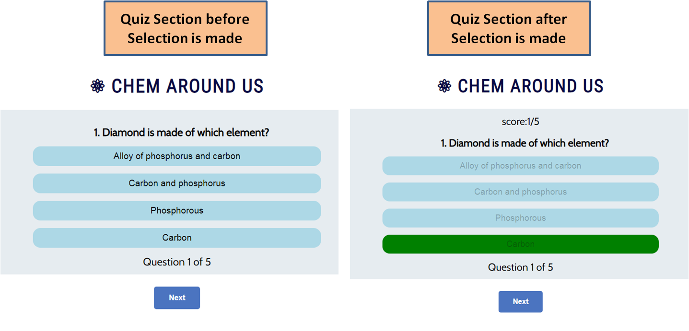
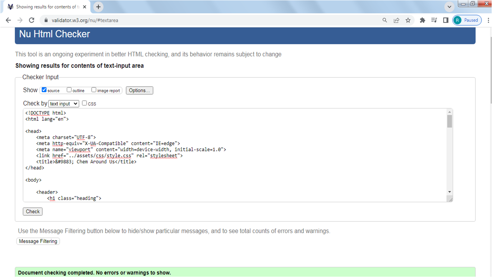

# CHEM AROUND US
A chemistry based informative Quiz for all. The inspiration is to provide a small challenge to the user and let them know how chemistry is everywhere. This quiz will leave them with some little extra knowledge and a smile! 
 
**So go ahead and have some fun!!**

## CONTENTS
- <a href= "#ux">User Experience UX </a> 
- <a href= "#us"> User Stories </a>
    -  <a href= "#first-time"> First Time Visitor Goals </a>
    -  <a href= "#returning"> Returning Visitor Goals</a>
-  <a href= "#design">Design</a>
    - <a href= "#quiz"> Quiz Structure</a>
    -  <a href= "#typography">Typography</a>
    -  <a href= "#wireframes">Wireframes</a>
-  <a href= "#features">Features</a>
    -  <a href= "#landing">Landing Section</a>
    -  <a href= "#quiz">Quiz Section</a>
    -  <a href= "#result">Result Area </a>
    -  <a href= "#accessibilty">Accessibility</a>
- <a href= "#technologies">Technologies</a>
- <a href= "#languages">Languages Used</a>
- <a href= "#libraries">Libraries Used</a>
- <a href= "#issues">Issues and Fixes</a>
- <a href= "#testing">Testing </a>
-  <a href= "#validation">Validation</a>
    -  <a href= "#w3c-html">W3C Validator (HTML)</a>
    -  <a href= "#w3c-css">W3C Jigsaw Validator (CSS)</a>
    -  <a href= "#jshint">JSHint (Javascript)</a>
-  <a href= "#performance">Performance</a>
    -  <a href= "#lighthouse">Lighthouse Tool</a>
    -  <a href= "#wave">WAVE Accessibilty Tool</a>
-  <a href= "#deployment">Deployment</a>
    -  <a href= "#deploy">Project Deployment on GitHub pages</a>
-  <a href= "#credits">Credits</a>
    -  <a href= "#content">Content</a>
    - <a href= "#media">Media</a>
-  <a href= "#acknowledgements">Acknowledgements</a>

<h2 id = "ux"> USER EXPERIENCE UX </h2>

- <h3 id = "us"> User Stories </h3>

    - <h3 id = "first-time">  First Time Visitor Goals</h3>
        -  As a student who is looking for a chemistry-based quiz, I want to solve challenges in the quiz that are inspired from academia, so that it helps me learn new concepts. 
         
        - As a student who is looking for a chemistry-based quiz, I want to be given one chance only to click an answer, so that it lets me assess myself well. 
         
        - As a student who is looking for a chemistry-based quiz, I want to get awarded for my efforts and my scores to be evaluated, so that I can assess how good I know the subject.
         
        - As a student who is looking for a chemistry-based quiz, I wish to be able to rate the quiz, so that I can let the creator know how I felt.

    - <h3 id="returning"> Returning Visitor Goals</h3>
        - As a student who is revisiting the quiz, I want to be encouraged to play the quiz again and again, so that they I can memorize the contents thoroghly.
         
        - As a student who is revisiting the quiz, I want to retake the quiz if my scores are low, so that I can try again and learn the answers well.

<h2 id = "design"> DESIGN </h2>

- <h3 id="quiz-struture">  Quiz Structure </h3>
    The quiz consists of three main sections on a page, excluding the header. The <a href= "#landing">landing section</a> gives user an <a href = "#introduction">introduction </a>about the structure of the quiz and a <a href = "#username-input">username input box </a> to enter their username entry. Upon entering their valid username, a <a href= "#lets-begin"> "Let's Begin"</a> button appears. When clicked the user is led to the <a href= "#quiz">quiz section</a> containing 5 multiple choice questions. Users can select the answers and can go ahead to the next questions by clicking <a href= "#next">next button</a> . After finishing the questions the user raeches the <a href= "#result">result section</a>. User can see their scores and a message with their name. Users can also provide <a href= "rating"> rating</a> by selecting the stars. If the user chooses to play the quiz again. They can click <a href= "back"> Back to Quiz Button</a> and the quiz gets reloaded.

- <h3 id="typography"> Typography </h3>
    - Google Fonts was used for the following fonts:
         
    - Font-family= Cabin - for all the paragraphs and normal text.
         
    - Font-family= Roboto Condensed for all headings.
         
    - UTF-8 Symbol was used as quiz logo - Atom symbol (Dec - 9883) and for rating section - white star (Dec : 9734) and filled star (Dec - 9733).

- <h3 id="wireframes"> Wireframes </h3>
    To model the quiz and to design the User Interfaces better, Wireframes were created for the website using <a href= "https://balsamiq.com/">Balsamiq</a>.    
    

<h2 id = "features"> FEATURES </h2>

- <h3 id= "landing"> Landing Section </h3>
    Landing section is the first page view of the quiz to the user. The section contains header, introduction to the quiz, username input box, a submit button. The details can be found in the picture below.
    

    - <h3 id= "header"> Header</h3>
        Header consists of a symbol of an atom used as a logo (Unicode UTF-8/Unicode Transformation Format) and name of the quiz "Chem Around Us."

    - <h3 id= "introduction"> Introduction Area </h3>
        The text in the introduction area gives a description of the quiz.

    - <h3 id= "username-input"> Username Input Field </h3>
        Username input area allows the user to enter a username that will later appear as a welcome message in the same page and the name will also appear in the result message area. The validation rules are described here:
    

    - <h3 id= "lets-begin"> Let's Begin Button</h3>
    This button appears when the user submits the valid acceptable username. By clicking this button the quiz section will be rendered visible to the user.

- <h3 id= "quiz"> Quiz Section</h3>
    
    Quiz section contains header that is consistent with the landing section. The area is divided into the categories as shown below.

    

    The quiz area will initially contain just question and answers. When an option is clicked, a live-score area and the status information gets added to the quiz area. 

    
    
    - <h3 id= "question"> Question Area</h3>
        Each time the next button is clicked, a new question gets loaded onto the quiz-box.

    - <h3 id= "option"> Option Area</h3>
        Each question has 4 choices for the user to select from. User is allowed to click on only one option. Once the selection is made, the other buttons will become inactive. The correct answer will appear as green button and wrong one in red color. Even is the rong answer is clicked the correct answer will appear in green color in oredr to guide the user to the right answer. The live score span will also appear above the question and a status of question will appear at the bottom of the box.
        Each correct answer increments the score by the value of 1.

        
    
    - <h3 id= "next"> Next Button</h3>
        Next button when clicked loads a new set of options with a next question.

- <h3 id= "result"> Results Area </h3>

    After the user makes the selection of option of the last question, the result area will appear on the screen. The details are provided in the image below. A message containing the username will appear in the result area.

    

    - <h3 id= "score"> Score Area</h3>
    Final score will appear in this area. If user skips all selection, a message to make selection will appear in the same position.

    - <h3 id= "rating"> Rating</h3>

    This area contains 5 white star symbols. User can click on their preferred number olloing which the selected stars will appear filled and a rating score will appear below.

    

    - <h3 id= "back"> Back to Quiz Button</h3>

    This button is a reset type button. The user lands on the first landing page upon clicking it.
    
- <h3 id= "accessibility"> Accessibility</h3>

    The quiz is rendered accessible as much as possible by using semantic HTML elements, providing adequate contrast to the fonts. To further ensure that the site is accessible tests with the Web Accessibility Evaluation Tool (WAVE) were conducted.

<h2 id="technologies">TECHNOLOGIES</h2>

<h3 id= "languages"> Languages Used</h3>

This quiz is created  using HTML5, CSS3 and JavaScript.

<h3 id= "libraries"> Libraries Used</h3>

- Git - For version control
- GitHub - To create my repositories, save and store my project files
- Google Fonts - To import fonts
- Font Awesome - For the iconography used in footer and links
- Google Dev Tools - To debug, troubleshoot and test features and adjust property values. Using the  Lighthouse extension installed in Chrome Browser, the performance report was generated.

<h2 id="issues">ISSUES AND FIXES </h2>

- Design Implementation

1. My initial plan involved superposing each page on one another. But as there are buttons in different pages, it got confusing and styling became very complicated, So, to remove the confusion, I introduced an additional page named "questions.html". From the index.html, the page was  linked using "action" tag. Clicking on which, user would directly get to the questions page. 
After recieving Mentor's suggestion on keeping no additional page and it is better in the initial stage to have a single html file i.e. "index.html". I copied all the codes from "questions.html" and pasted it to the "index.html" file. But there was an overlap of the sections, as I had provided style to #landing {position: absolute;} earlier. That was then changed to  #landing {position: relative;} and the overlapping or super position was solved.

2. Another change from the initial designs implemented were: removal of "Previous" button as the function implementation was going to be difficult as the data storage step would be involved.

3. Styling of each div was made easy using flexboxes so that respinsiveness could be easily implemented. Initially all the divs were placed on the same page as per to document flow. In order to make it superpose one above the other. The class attribute named "hide" was introduced with display set to none to the sections "quiz-box" and "result". When we aspire to display the desired section, we could turn its display on using JavaScript "quizBox.classList.remove('hide'). The other method used to hide the previous section is "quizBox.style.display = 'none';".

- Function Implementation

1. In quiz section, initially I provided spans to enter the options. But upon answer selection, the other options still remain clickable. So, the spans were then changed to buttons, as they allow the coder to implement - button "disabled" option. Using the code "option0.disabled = true" (similarly for all options),all the buttons are disabled the exact moment click is made, so that user can only make single selection and cannot select any other answer.
 
2. Second most troublesome issue I faced was once an option selection was made, the changes carried over to the next quiz-box options as well. The changes made would not revert to original. I solved it using the codes in the nextQuestion function:
function nextQuestion() {
    option0.disabled = false; // buttons for selection are enabled so that the user can make a choice.
    option0.style.background = 'lightblue'; // buttons are reset to the original colour, so that the changes made do not carry over.}.  
All the buttons were given similar logical conditions to each option button.
 
3. The third most challenging task was to get the correct answer appear green, even if the user selects the wrong answer and both the selcted wrong answer and the ecpected selecetd answer must appear on screen together. With my mentor's help, this issue was solved. By creating a new variable called options and was accessed using document.getElementById("options") from HTML . The correct option "correctChild" was located from the array and the correctChild/ correct option was given the color green. These codes were used to get the function to be executed:
let correctChild = Array.from(options.children).find(child => child.innerText === questionList[i].answer);
 
correctChild.firstChild.style.background = 'green';
 
This piece of code makes the correct answer appear green even with or without user clicking on it.
    
<h2 id="testing">TESTING </h2>

- <h3 id= "validation"> Validation</h3>

    - <h3 id= "w3c-html"> W3C Validator (HTML)</h3>

        To test compliance with HTML standards, the <a href= "https://validator.w3.org/">W3C Markup Validation Service</a> was used.
        Result of index.html validation: <strong> No errors found. </strong>

        

    - <h3 id= "w3c-css"> W3C Jigsaw Validator (CSS)</h3>

        To test compliance with HTML standards, the <a href= "https://jigsaw.w3.org/css-validator/">W3C CSS Validation Service - Jigsaw</a> was used.
     
        Result of CSS validation: <strong>No errors found.</strong>

    

    - <h3 id= "jshint"> JSHint (Javascript)</h3>

        <a href= "https://jshint.com/about/">JSHint</a>, which is a static Code Analysis Tool for JavaScript, was used to test compliance with JavaSCript standards.

        Result of JSHint validation: 
    
    

<h2 id="performance">PERFORMANCE </h2>

- <h3 id= "lighthouse"> Lighthouse Tool</h3>
    To test the performance, quality, and correctness of your web pages, <a href= "https://chrome.google.com/webstore/detail/lighthouse/blipmdconlkpinefehnmjammfjpmpbjk?hl=en">Lighthouse</a> chrome extension tool was used. Result:

    

- <h3 id= "wave"> WAVE Accessibilty Tool</h3>
     WAVE chrome extension is used to evaluate accessibility of the web content. WAVE did not report any errors or contrast errors.  

    

<h2 id="deployment">DEPLOYMENT </h2>

<h3 id= "deploy"> Project Deployment on GitHub pages</h3>

    GitHub pages were used to deploy the site. The steps to activate Github pages:

- Navigate to the <i>Settings</i> tab in the GitHub repository.
- Navigate to the 'Pages' tab on the left of the page.
- Go to the 'Build and deployment' section, select 'Deploy from a branch' in the <i>source</i> dropdown.
- Select branch 'main' and click on 'Save'.
- Deployment link generated: https://roshnavakkeel.github.io/Chem_Around_Us/

<h2 id= "credits"> CREDITS </h2>

- <h3 id= "content"> Content</h3>
    The fonts are imported from Google Fonts.
     
    A few references used for JS coding:

    - <a href = "https://medium.com/swlh/how-to-create-your-first-login-page-with-html-css-and-javascript-602dd71144f1"> Form username input</a>
     
    - <a href = "https://www.javatpoint.com/javascript-reset#:~:text=In%20JavaScript%2C%20the%20reset(),does%20not%20return%20any%20value."> "Back to start" button Reset function.</a>
     
    - Stack overflow to get better queries to solve multiple doubts. For eg. Regex code to validate username input.
     
    - Slack community online - especially to solve the JSHint warnings. It was done using going to Configurations>Assume>New JavaScript features (ES6) selection.

- <h3 id= "media"> Media</h3>

    - Youtube videos were referred to in order to understand and clarify many functions.
     
    - <a href = "https://www.youtube.com/watch?v=JQ-wmaarWTQ"> arrays for the quiz</a>.
     
    - <a href = "https://www.youtube.com/watch?v=2jwdyO_UunE"> for quiz functions like load question and score calculation</a>.

<h2 id= "acknowledgements"> ACKNOWLEDGEMENTS </h2>
I would like to acknowledge the following people who have helped me along the way in completing my second milestone project:

- My Mentor Jubril Akolade for his guidance, best suggestions and constant encouragement. I very much appreciate his coding tips that helped me solve really complicated challenges I faced.
- My fellow students for their company and encouragement. Kenan and Lane for guiding us through. Special thanks to Kristyna Maulerova for her encouragement and support.
- My tutors who helped me understand the concepts better.
